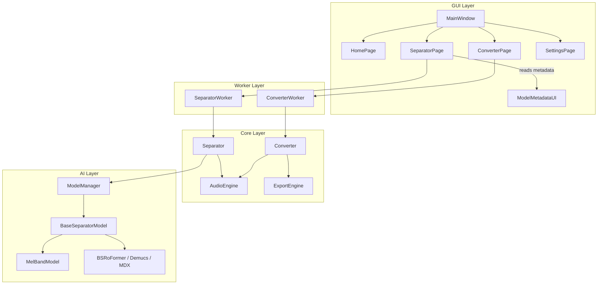
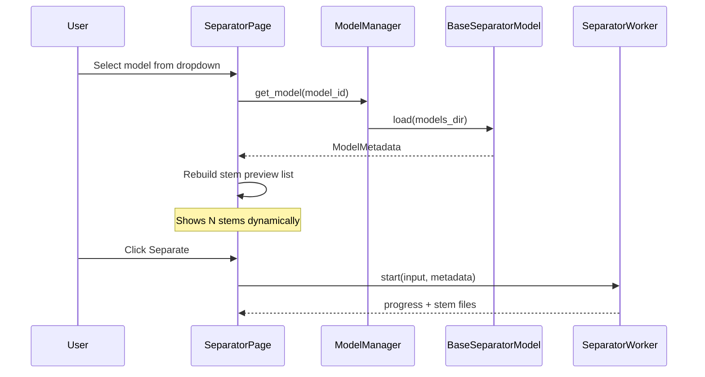

# Sound Processor v1.0 — Implementation Plan

## Project Location

Standalone Python project at `[/Users/mac/Documents/kuliah/Project/sound-processor/](file:///Users/mac/Documents/kuliah/Project/sound-processor/)` (new git repo, separate from `belajar-laravel`).

## Architecture Overview




## Key Design Decision: Dynamic Model Metadata

**No fixed stems, names, or output assumptions anywhere in the UI or separator engine.**

Every AI model implements a common interface and exposes metadata at load time:

```python
@dataclass(frozen=True)
class ModelMetadata:
    model_id: str
    display_name: str
    stem_names: tuple[str, ...]      # e.g. ("vocals", "instrumental")
    output_format: str               # e.g. "wav" — per-model, not global
    sample_rate: int
    input_formats: tuple[str, ...]   # e.g. ("wav", "mp3", "flac")
    description: str = ""

class BaseSeparatorModel(ABC):
    @abstractmethod
    def load(self, models_dir: Path) -> ModelMetadata: ...

    @abstractmethod
    def separate(
        self,
        input_path: Path,
        output_dir: Path,
        on_progress: Callable[[float, str], None],
        cancel_flag: threading.Event,
    ) -> dict[str, Path]: ...        # stem_name -> file path
```

**v1.0 default — MelBand-RoFormer Kim vocal model** exposes:

- `stem_names: ("vocals", "instrumental")`
- `output_format: "wav"`
- `sample_rate: 44100`

Future models (e.g. a 9-stem drum kit model with `kick`, `snare`, `toms`, etc.) register via `ModelManager` and the UI adapts automatically — zero UI code changes.

### UI Auto-Generation Flow




`[separator_page.py](gui/separator_page.py)` will contain a `StemPreviewWidget` that rebuilds its child labels whenever the model dropdown changes, reading `metadata.stem_names`.

---

## Directory Structure

```
sound-processor/
├── main.py
├── requirements.txt
├── README.md
├── gui/
│   ├── main_window.py
│   ├── home_page.py
│   ├── converter_page.py
│   ├── separator_page.py
│   ├── settings_page.py
│   └── widgets/
│       ├── drop_zone.py
│       ├── log_panel.py
│       ├── progress_panel.py
│       └── stem_preview.py
├── core/
│   ├── audio_engine.py
│   ├── converter.py
│   ├── separator.py
│   └── exporter.py
├── ai/
│   ├── base_model.py          # BaseSeparatorModel + ModelMetadata
│   ├── model_manager.py       # Registry + lazy loading
│   └── melband.py             # MelBand-RoFormer v1 implementation
├── workers/
│   ├── base_worker.py         # Shared signals (progress, log, error, finished)
│   ├── converter_worker.py
│   └── separator_worker.py
├── audio/
│   ├── loader.py              # FFmpeg-backed decode
│   ├── writer.py              # Format-specific write
│   └── metadata.py            # Probe duration, channels, sample rate
├── utils/
│   ├── logger.py
│   ├── config.py              # QSettings-backed persistent config
│   ├── validators.py
│   └── file_utils.py
├── models/                    # User-downloaded AI weights (gitignored)
├── assets/
│   ├── icons/
│   └── themes/dark.qss
├── outputs/                   # Default output (gitignored)
└── logs/                      # Rotating log files (gitignored)
```

---

## Module 1: Audio Converter

### Shared Engines

`**[core/audio_engine.py](core/audio_engine.py)**` — single entry point for all audio I/O:

- `load(path) -> AudioBuffer` (numpy array + metadata, streamed for large files)
- `resample(buffer, target_sr)`
- `normalize(buffer)`
- `decode_via_ffmpeg(path)` for MP3/FLAC when needed

`**[core/exporter.py](core/exporter.py)**` — format-specific export:

- WAV: sample rate (44100/48000/96000), bit depth (16/24/32-float) via `soundfile`
- MP3: bitrate (128/192/256/320 kbps) via FFmpeg subprocess
- FLAC: compression level 0–8 via `soundfile` or FFmpeg

`**[core/converter.py](core/converter.py)**` — orchestrates load → transform → export; used by both single and batch modes.

### Conversion Matrix (v1.0)


| Input | Output | Engine path                                |
| ----- | ------ | ------------------------------------------ |
| MP3   | WAV    | FFmpeg decode → resample → soundfile write |
| WAV   | MP3    | soundfile read → FFmpeg encode             |
| WAV   | FLAC   | soundfile read/write                       |
| FLAC  | WAV    | soundfile read/write                       |
| MP3   | FLAC   | FFmpeg decode → soundfile write            |
| FLAC  | MP3    | soundfile read → FFmpeg encode             |


### Converter Page UI

`[gui/converter_page.py](gui/converter_page.py)` + reusable widgets:

- `DropZone` — drag-and-drop + folder picker (batch)
- `LogPanel` — scrollable, auto-scroll
- `ProgressPanel` — per-file + overall progress bar
- Format dropdown drives conditional settings panel (WAV/MP3/FLAC options shown/hidden dynamically)
- Output folder picker (defaults to Settings value)

### Worker

`[workers/converter_worker.py](workers/converter_worker.py)` — `QThread` subclass:

- Signals: `progress(int, str)`, `log(str)`, `file_done(str)`, `error(str)`, `finished()`
- Supports cancel via `threading.Event`
- Iterates file list; never touches UI directly

---

## Module 2: AI Instrument Separator

### Model Manager

`[ai/model_manager.py](ai/model_manager.py)`:

- Registry dict: `model_id -> factory`
- `list_models() -> list[ModelMetadata]` (lightweight, no weight load)
- `get_model(model_id) -> BaseSeparatorModel` (lazy instantiate)
- v1.0 registers only `melband-roformer-kim-vocals`
- Extension point: `register_model("bs-roformer-sw", BSRoFormerModel)` — no other files change

### MelBand Implementation

`[ai/melband.py](ai/melband.py)`:

- Wraps `melband-roformer-infer` (`ensure_model_assets`, `get_model_from_config`, `demix_track`)
- Lazy-imports `torch` inside `load()` / `separate()` to keep app startup fast
- `load()` returns `ModelMetadata(stem_names=("vocals", "instrumental"), ...)`
- `separate()` writes `{stem_name}.wav` per returned stem dict key
- Preprocesses input: resample to model's `sample_rate`, mono→stereo if needed via `AudioEngine`
- Handles missing model: triggers download with progress callback
- Configurable `chunk_size` from Settings (VRAM tuning)

### Separator Core

`[core/separator.py](core/separator.py)`:

- Accepts `BaseSeparatorModel` + input path — **no stem assumptions**
- Delegates to `model.separate()`
- Validates returned stem dict keys match `metadata.stem_names`
- Maps errors to user-friendly messages

### Separator Page UI

`[gui/separator_page.py](gui/separator_page.py)`:

- Model dropdown populated from `ModelManager.list_models()`
- On model change → `StemPreviewWidget.update_stems(metadata.stem_names)`
- Shows: input info (duration, format, channels from `audio/metadata.py`)
- Progress bar + estimated time remaining (rolling average of per-chunk timing)
- Cancel button sets worker cancel flag
- Log panel mirrors worker signals

---

## GUI Shell

### Main Window

`[gui/main_window.py](gui/main_window.py)`:

- `QStackedWidget` for page switching
- Left sidebar nav: Home, Converter, Separator, Settings
- Applies dark theme QSS from `[assets/themes/dark.qss](assets/themes/dark.qss)`
- Window title: "Sound Processor v1.0"

### Home Page

`[gui/home_page.py](gui/home_page.py)`:

- App name, version, quick-access buttons to Converter and Separator

### Settings Page

`[gui/settings_page.py](gui/settings_page.py)` — persisted via `[utils/config.py](utils/config.py)` (`QSettings`):

- Default output folder
- Theme (dark only in v1.0, extensible)
- FFmpeg path (auto-detect + manual override)
- Model folder path
- MelBand chunk size (VRAM slider)

---

## Threading Contract

All heavy work in `QThread` workers. Communication exclusively via Qt signals:

```python
class WorkerSignals(QObject):
    progress = Signal(float, str)       # percent, status message
    log = Signal(str)
    error = Signal(str)                 # user-facing message
    finished = Signal(object)           # result or None
```

UI thread: only updates widgets in signal slots. Never call `model.separate()` or `converter.convert()` on the main thread.

---

## Logging

`[utils/logger.py](utils/logger.py)`:

- `logging` module with rotating file handler → `logs/sound_processor.log`
- Custom `QtLogHandler` bridges logs to GUI `LogPanel`
- Log levels: INFO for milestones, DEBUG for internals, ERROR with full `traceback.format_exc()`
- Standard messages: "Loading file...", "Initializing model...", "Separating stems...", "Writing output...", "Completed successfully."

---

## Error Handling

Centralized in workers + engines; never let exceptions propagate to crash the app:


| Error             | Handling                                                  |
| ----------------- | --------------------------------------------------------- |
| Unsupported file  | Validate extension + probe before processing; show dialog |
| Missing FFmpeg    | Check on startup + before MP3 ops; link to Settings       |
| Missing AI model  | Offer download or point to model folder in Settings       |
| Corrupted audio   | Catch decode errors; log stack trace; skip file in batch  |
| Permission denied | Catch `PermissionError`; show path in error dialog        |
| Out of disk space | Catch `OSError` errno 28; abort gracefully                |
| Cancelled         | Check `cancel_flag` between chunks; clean partial outputs |


---

## Performance

- Stream large files (>2 GB) via FFmpeg pipe / chunked reads — never load full file into RAM for conversion
- Reuse numpy buffers in `AudioEngine` where possible
- AI inference: MelBand's built-in overlap-add chunking (`chunk_size` configurable)
- Lazy model load: weights loaded once per session, not per file in batch mode

---

## Dependencies (`[requirements.txt](requirements.txt)`)

```
PySide6>=6.6
torch>=2.0
torchaudio>=2.0
numpy>=1.26
soundfile>=0.12
librosa>=0.10
melband-roformer-infer>=0.1
ml-collections
PyYAML
```

FFmpeg: system dependency, path configurable in Settings. Bundling notes in README for each platform.

---

## Implementation Order

Build bottom-up so each layer is testable before GUI wiring:

1. **Foundation** — `utils/` (config, logger, validators, file_utils) + `audio/` (loader, writer, metadata)
2. **Engines** — `audio_engine.py`, `exporter.py`, `converter.py`
3. **AI layer** — `base_model.py`, `model_manager.py`, `melband.py`
4. **Core separator** — `separator.py`
5. **Workers** — `base_worker.py`, `converter_worker.py`, `separator_worker.py`
6. **GUI widgets** — drop_zone, log_panel, progress_panel, stem_preview
7. **GUI pages** — home, converter, separator, settings
8. **Shell** — main_window, dark theme QSS, `main.py` entry point
9. **Polish** — error paths, batch mode, cancel, ETA, README

---

## v1.0 Acceptance Criteria

- Modern dark-themed PySide6 desktop UI with sidebar navigation
- All 6 conversion pairs (MP3/WAV/FLAC cross-conversion) with format-specific settings
- Drag-and-drop, single file, batch, and folder selection
- AI separation via MelBand-RoFormer (2 stems: vocals + instrumental)
- **Dynamic stem UI** driven by `ModelMetadata` — adding a new model requires only a new `BaseSeparatorModel` subclass + `register_model()` call
- Worker threads with progress, cancel, and log output
- Shared Audio Engine and Export Engine (no duplicated I/O logic)
- Centralized logging with stack traces on errors
- Graceful error handling — app never crashes on bad input
- Cross-platform structure (macOS primary dev, Windows/Linux compatible paths)