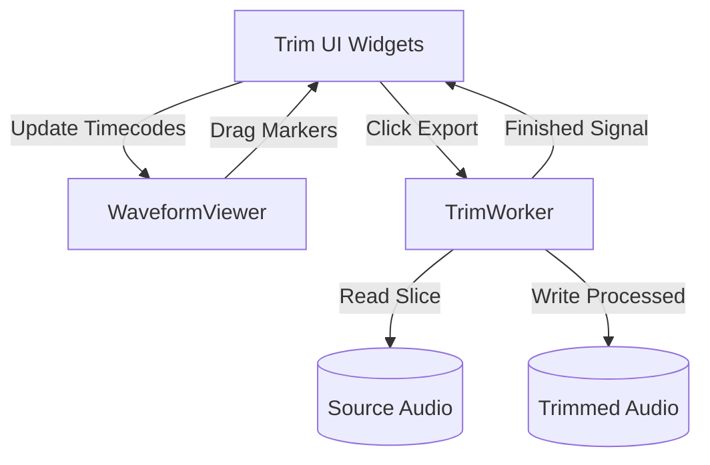

# Audio Trim Utility (V3.0)

## Overview

The `AudioTrim` module is a specialized utility within the Sound Processor suite designed to crop audio files to a specific time range *prior* to importing them into a DAW.

**IMPORTANT NOTE:** This is **NOT** a non-linear editor (NLE) or a full audio editor. It performs a single, destructive (to the output copy) trim operation defined by a start point and an end point. It is built to quickly discard unwanted pre-roll or post-roll audio.

## Data Model

The trimming parameters are encapsulated in a simple dataclass.

```python
from dataclasses import dataclass

@dataclass
class TrimOptions:
    """
    Defines the parameters for a single trim operation.
    """
    start_sec: float
    end_sec: float
    fade_in_ms: float = 0.0
    fade_out_ms: float = 0.0
    
    def validate(self, total_duration: float):
        if self.start_sec < 0 or self.end_sec > total_duration:
            raise ValueError("Trim points out of bounds.")
        if self.start_sec >= self.end_sec:
            raise ValueError("Start time must be before end time.")
```

## Core Implementation: `trimmer.py`

The actual audio processing is handled by the `core.trimmer` module using `soundfile` and `numpy`.

```python
import soundfile as sf
import numpy as np
from pathlib import Path
from typing import Tuple

class AudioTrimmer:
    @staticmethod
    def apply_trim(input_path: Path, output_path: Path, options: TrimOptions) -> None:
        """
        Loads the audio, slices it based on TrimOptions, applies fades, and exports.
        """
        # 1. Get info to calculate frames
        info = sf.info(str(input_path))
        start_frame = int(options.start_sec * info.samplerate)
        frames_to_read = int((options.end_sec - options.start_sec) * info.samplerate)
        
        # 2. Read only the required slice (saves memory)
        data, sr = sf.read(str(input_path), start=start_frame, frames=frames_to_read)
        
        # 3. Apply Fades
        if options.fade_in_ms > 0:
            data = AudioTrimmer._apply_fade_in(data, sr, options.fade_in_ms)
        if options.fade_out_ms > 0:
            data = AudioTrimmer._apply_fade_out(data, sr, options.fade_out_ms)
            
        # 4. Export
        sf.write(str(output_path), data, sr, format=info.format, subtype=info.subtype)
        
    @staticmethod
    def _apply_fade_in(data: np.ndarray, sr: int, fade_ms: float) -> np.ndarray:
        fade_frames = int((fade_ms / 1000.0) * sr)
        fade_frames = min(fade_frames, len(data))
        curve = np.linspace(0.0, 1.0, fade_frames, dtype=data.dtype)
        
        if data.ndim > 1:
            curve = curve[:, np.newaxis]
            
        data[:fade_frames] *= curve
        return data

    @staticmethod
    def _apply_fade_out(data: np.ndarray, sr: int, fade_ms: float) -> np.ndarray:
        # Implementation symmetric to fade_in
        pass
```

## Multithreading: `TrimWorker`

To prevent the UI from freezing during the disk I/O and processing of the trim operation, a `QThread` is used.

```python
from PyQt6.QtCore import QThread, pyqtSignal
from pathlib import Path

class TrimWorker(QThread):
    finished = pyqtSignal(Path)
    error = pyqtSignal(str)
    
    def __init__(self, input_path: Path, output_path: Path, options: TrimOptions):
        super().__init__()
        self.input_path = input_path
        self.output_path = output_path
        self.options = options
        
    def run(self):
        try:
            AudioTrimmer.apply_trim(self.input_path, self.output_path, self.options)
            self.finished.emit(self.output_path)
        except Exception as e:
            self.error.emit(str(e))
```

## User Interface & Integration

The Trim UI acts as a specialized control panel that docks near the `WaveformViewer`. 

### UI Layout

```text
+-----------------------------------------------------------+
| Waveform Viewer Integration Area                          |
|                                                           |
|       | [==== KEEP ====] |                                |
| ======|==================|======================          |
|       |                  |                                |
|    Start (00:01.00)   End (00:03.50)                      |
+-----------------------------------------------------------+
| Trim Settings                                             |
| Start:  [ 00:01:00.000 ]   Fade In:  [ 10 ] ms            |
| End:    [ 00:03:30.000 ]   Fade Out: [ 10 ] ms            |
|                                                           |
|                     [ EXPORT TRIMMED ]                    |
+-----------------------------------------------------------+
```

### Integration Diagram



## Output Naming Convention

By default, the trimmed file is saved in the same directory as the source file. The naming convention appends a suffix to prevent accidental overwriting:

`{original_filename}_trimmed.wav`

Example: `vocals_take1.wav` -> `vocals_take1_trimmed.wav`

## Batch Trimming

The module supports applying the identical `TrimOptions` to multiple files simultaneously. This is useful for multi-mic setups (e.g., drum stems) where the start and end points must be exactly synchronized across all tracks. 
The UI provides a "Apply to all loaded files" checkbox, which spawns multiple `TrimWorker` instances managed by a QThreadPool.
